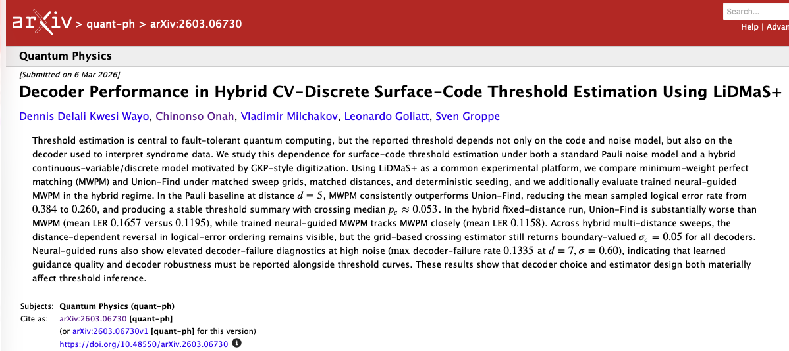

<p align="center">
  
  
  
</p>

# LiDMaS+

**Logical Injection & Decoding Modeling System**

LiDMaS+ is a C++ research simulator for quantum error-correction studies, with
surface-code threshold experiments under discrete Pauli noise and hybrid
continuous-variable (CV)-discrete noise models as the primary workflow. It also
includes CSS and LDPC engine paths for comparative studies.

Install from PyPI:

```bash
python -m pip install --upgrade lidmas
```

Then run:

```bash
lidmas --help
```

Documentation:

- [GitHub Pages Documentation](https://denniswayo.github.io/lidmas_cpp/)
- Read the Docs mirror is currently unavailable.

## Statement of Need

Benchmarking decoder behavior and threshold trends requires reproducible, scriptable,
and inspectable simulation pipelines. LiDMaS+ provides:

- deterministic Monte Carlo runs with explicit seed control,
- multiple decoders under a common interface,
- confidence-interval-aware threshold outputs,
- numerous reproducible workflows and scripts across `examples/`.

This makes it suitable for method development, reproducibility appendices, and
comparative decoder studies.

## Core Capabilities

- Surface-code simulation with configurable code distance and trial counts.
- CSS and LDPC demo/threshold workflows via engine switching.
- Decoder plugins: `mwpm`, `uf`, `neural_mwpm`.
- Noise modes:
  - `pauli`: sweep logical error rate versus physical Pauli error rate `p`.
  - `hybrid`: sweep logical error rate versus CV displacement scale `sigma` using GKP digitization.
- Optional threshold analysis tools (crossing estimates and scaling fits).
- Reproducible example suite under `examples/`.

## Requirements

- C++20 compiler
- CMake >= 3.16
- Optional: OpenMP for parallel threshold runs
- Optional: CUDA toolkit (for GPU-accelerated Pauli surface_threshold sampling)
- Optional (for plots): Python 3 with `matplotlib` and `pandas`

## Build

```bash
cmake -S . -B build
cmake --build build -j
```

Primary executable:

- `build/lidmas`

## Packaging Notes

- Brand name remains **LiDMaS+**.
- PyPI package name is `lidmas`.
- CLI command is `lidmas`.
- Published wheels are CPU-oriented; CUDA builds are supported from source builds.

### Optional CUDA build (Pauli surface_threshold sampling)

```bash
cmake -S . -B build -DLIDMAS_ENABLE_CUDA=ON
cmake --build build -j
```

At runtime, enable with:

```bash
./build/lidmas --engine=surface --surface_threshold --mode=pauli --gpu ...
```

Quick benchmark:

```bash
./build/lidmas --gpu_bench
./build/lidmas --gpu_bench_quick
./build/lidmas --gpu_bench_full
```

## Quick Start

Show CLI help:

```bash
./build/lidmas --help
```

Run deterministic smoke test:

```bash
./build/lidmas --smoke
```

Run a Pauli threshold sweep (surface engine):

```bash
./build/lidmas --engine=surface --surface_threshold \
  --mode=pauli \
  --decoder=mwpm \
  --d=3,5,7 \
  --p_start=0.01 --p_end=0.15 --p_step=0.01 \
  --trials=2000 \
  --seed=1337 \
  --out=surface_threshold.csv
```

Run a hybrid CV sweep (surface engine):

```bash
./build/lidmas --engine=surface --surface_threshold \
  --mode=hybrid \
  --decoder=mwpm \
  --d=3,5,7 \
  --sigma_start=0.05 --sigma_end=0.60 --sigma_step=0.05 \
  --trials=2000 \
  --seed=1337 \
  --out=surface_threshold.csv
```

Run a native GKP sweep (surface engine):

```bash
./build/lidmas --engine=surface --surface_threshold \
  --mode=gkp \
  --decoder=mwpm \
  --d=3,5,7 \
  --sigma_start=0.05 --sigma_end=0.60 --sigma_step=0.05 \
  --gkp_gate=0.0005 --gkp_meas=0.0005 --gkp_idle=0.0002 \
  --gkp_loss=0.001 \
  --trials=2000 \
  --seed=1337 \
  --out=gkp_surface_threshold.csv
```

Neural decoder note:

- `--decoder=neural_mwpm` requires `--neural_model=<path>`.
- A trained reference model is provided at `examples/decoder_comparison/trained_model.json`.
- To retrain it, run `python3 examples/decoder_comparison/train_neural_model.py`.

CSS engine demo / threshold (experimental):

```bash
./build/lidmas --engine=css \
  --css_spec=examples/css_codes/steane/spec.yaml

./build/lidmas --engine=css \
  --css_repetition=7
./build/lidmas --engine=css \
  --css_shor

./build/lidmas --engine=css --css_threshold --mode=pauli --trials=2000 \
  --css_spec=examples/css_codes/steane/spec.yaml \
  --out=css_threshold.csv
```

CSS matrix files are dense 0/1 text (space or comma separated). Logical files can include multiple rows.

`--css_repetition=<n>` builds a bit-flip repetition code automatically (Hx empty, Hz chain).
`--css_shor` builds the Shor [[9,1,3]] code automatically.

LDPC engine (default):

```bash
./build/lidmas --engine=ldpc
```

## Reproducible Examples

The `examples/` directory contains ready-to-run scripts for smoke checks,
Pauli/hybrid thresholds, scaling workflows, decoder comparison, and plotting.

Setup once:

```bash
./examples/setup_env.sh
```

Run a minimal end-to-end check:

```bash
bash examples/quick_smoke/run.sh
```

Generated artifacts are written to:

- `examples/results/<example_name>/`

## Output Schema

Threshold CSV output uses:

- `mode,distance,sigma,pauli_p,trials,ler,ci_low,ci_high,defect_mean,weight_mean,decoder_fail_rate,mwpm_weight_scale,mwpm_graph,timestamp`

## Validation

For quick validation in local or CI environments:

```bash
./build/lidmas --smoke
```

## Hardware Integration

See [hardware-integration](https://denniswayo.github.io/lidmas_cpp/hardware-integration/) for the decoder IO schema,
recommended data transport, and adapter API.

## Project Layout

```text
include/   # public headers and interfaces
src/       # simulator and decoder implementations
examples/  # reproducible runs and plotting scripts
```

## Release Notes

Detailed release notes and version-specific changes are tracked in Git tags and
GitHub Releases.

## Citation

If you use LiDMaS+ in academic work, cite the software release used for your
experiments (tag + commit hash). 

Paper reference (`paper_01`):



```bibtex
@misc{wayo2026decoder,
  title={Decoder Performance in Hybrid CV-Discrete Surface-Code Threshold Estimation Using LiDMaS+},
  author={Dennis Delali Kwesi Wayo and Chinonso Onah and Vladimir Milchakov and Leonardo Goliatt and Sven Groppe},
  year={2026},
  eprint={2603.06730},
  archivePrefix={arXiv},
  primaryClass={quant-ph},
  url={https://arxiv.org/abs/2603.06730}
}
```

## License

This project is released under the MIT License (see `LICENSE`).

## Contributing

Issues and pull requests are welcome. Please include:

- a clear problem statement,
- reproduction steps,
- expected versus observed behavior,
- and, where possible, a minimal test or script.
