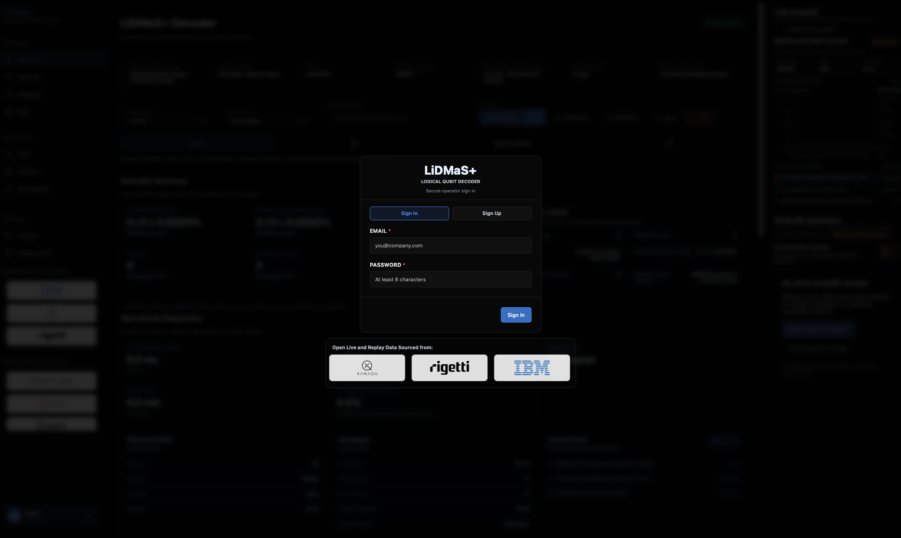
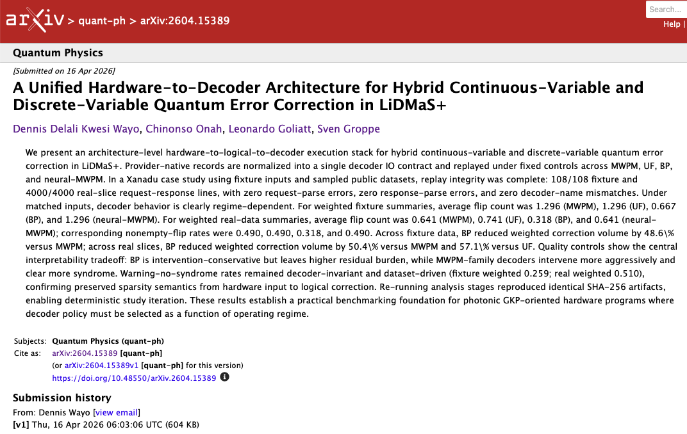

<p align="center">
  
  
  <a href="https://pypi.org/project/lidmas/"></a>
  <a href="https://github.com/DennisWayo/lidmas_cpp/actions/workflows/ci.yml"></a>
  <a href="https://denniswayo.github.io/lidmas_cpp/"></a>
  
</p>

# LiDMaS+

**Logical Injection & Decoding Modeling System**  
LiDMaS+ is an open-source CLI toolkit for reproducible quantum error-correction simulation, decoder benchmarking, and hardware-to-decoder replay. This exists to make QEC experiments reproducible, scriptable, and directly comparable across codes, decoders, and hardware data pipelines.

Current coverage:

- **Correction code engines**: Surface, CSS family (including custom CSS specs/matrices, repetition, and Shor), and LDPC.
- **GKP support**: Available in current CLI flows as hybrid/native Surface workflows (`--mode=hybrid` and `--mode=gkp`), i.e., CV/GKP behavior integrated into Surface-mode experiments.
- **Decoders**: `mwpm`, `uf`, `bp`, `neural_mwpm`, and `stub`.
- **Targeted hardware providers**: IBM Quantum (live superconducting telemetry), Rigetti/Ankaa workflows (replay), and Xanadu datasets (Aurora/QCA/GKP replay).
- **Quantum software stacks**: Qiskit IBM Runtime, PennyLane, Qiskit, Cirq, and planned Qibo/Qibolab integration.

It provides:

- a unified CLI for running simulation and replay workflows,
- deterministic runs with explicit seed control,
- reusable examples for thresholds, replay, and analysis outputs.

If you need the full technical depth, use the published [docs](https://denniswayo.github.io/lidmas_cpp/)

## Statement of Need

Quantum error-correction studies are often hard to reproduce across teams because workflows, decoder settings, and data formats vary across scripts and hardware sources.

LiDMaS+ addresses this by giving researchers and engineers a single CLI and repeatable workflow surface for:

- deterministic simulation runs,
- consistent decoder comparison,
- hardware-to-decoder replay and artifact generation.



UI status: under active development. For stable workflows today, use the CLI (`lidmas`) below.

## Getting Started

### Prerequisites

- C++20 compiler
- CMake >= 3.16
- Python 3.9+ (for PyPI install path and optional scripts)
- Optional: OpenMP
- Optional: CUDA toolkit (GPU sampling path)

### Installation

Install from PyPI:

```bash
python -m pip install --upgrade lidmas
```

This installs the `lidmas` CLI so you can run LiDMaS+ commands directly from your shell.

Or build from source:

```bash
cmake -S . -B build
cmake --build build -j
```

### Usage

Show available commands:

```bash
lidmas --help
```

Run a quick smoke check:

```bash
lidmas --smoke
```

Run from source build (without PyPI install):

```bash
./build/lidmas --help
./build/lidmas --smoke
```

For full examples and workflow guides:

- [Getting-Started](https://denniswayo.github.io/lidmas_cpp/getting-started/)
- [CLI-reference](https://denniswayo.github.io/lidmas_cpp/cli-reference/)
- [Examples-workflows](https://denniswayo.github.io/lidmas_cpp/examples-workflows/)

## Hardware Integrations

| Mode | Integration | Company / Provider | Quantum Software Stack |
|---|---|---|---|
| Live | IBM superconducting stream polling | IBM Quantum | Qiskit IBM Runtime |
| Live (planned) | Qibolab hardware backend integration | Qibo/Qibolab self-hosted labs | Qibo + Qibolab |
| Replay | Ankaa superconducting replay stream | Rigetti (Ankaa workflows) | LiDMaS adapter stream (fixture/HDF5 replay) |
| Replay | Xanadu Aurora/QCA/GKP dataset conversion + replay | Xanadu | Python converter + LiDMaS `decoder_io_replay` |
| Replay | Simulator framework replay | PennyLane / Qiskit / Cirq ecosystems | PennyLane, Qiskit, Cirq |

Hardware Integration examples and commands are documented [here](https://denniswayo.github.io/lidmas_cpp/hardware-integration/)

## Contributing

Bug reports, feature requests, and pull requests are welcome.

- Contribution guide: [CONTRIBUTING.md](CONTRIBUTING.md)
- Code of conduct: [CODE_OF_CONDUCT.md](CODE_OF_CONDUCT.md)
- Security policy: [SECURITY.md](SECURITY.md)

## Citation

If you use LiDMaS+ in academic work, cite the software release used for your experiments (tag + commit hash).

Paper reference (`paper_03`):



```bibtex
@misc{wayo2026unifiedhardwaretodecoderarchitecturehybrid,
  title={A Unified Hardware-to-Decoder Architecture for Hybrid Continuous-Variable and Discrete-Variable Quantum Error Correction in LiDMaS+},
  author={Dennis Delali Kwesi Wayo and Chinonso Onah and Leonardo Goliatt and Sven Groppe},
  year={2026},
  eprint={2604.15389},
  archivePrefix={arXiv},
  primaryClass={quant-ph},
  url={https://arxiv.org/abs/2604.15389}
}
```

## License

This project is licensed under the MIT License.  
See [LICENSE](LICENSE).
